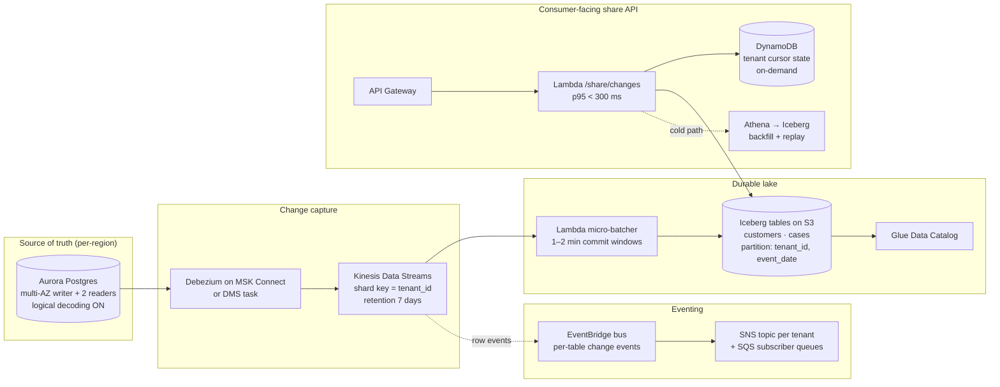

# Production AWS Architecture

Production ingestion + sharing for the same problem domain — **not** a
lift-and-shift of the local toy service. The local prototype's polling
endpoint is replaced by streaming CDC; the local JSONL lake is replaced
by Apache Iceberg on S3; the local share file becomes a queryable
consumer API backed by DynamoDB cursors and Iceberg time travel.

## Diagram

## Service choices and rationale

| Concern | Choice | Why |
|---|---|---|
| CDC | Debezium on MSK Connect (preferred) or DMS to Kinesis | Native Postgres logical decoding; ordered per-PK; mature operator surface; DMS is the simpler fallback if a managed Kafka is overkill. |
| Stream | Kinesis Data Streams, sharded by `tenant_id` | 5K writes/sec peak, ~50 shards at 1 MB/s/shard; enhanced fan-out only for the 2 hottest tenants. |
| Micro-batcher | Lambda with 1–2 min windows + KCL checkpointing | Stages a batch, computes deterministic `run_id` (same algorithm as the prototype), commits to Iceberg via a single snapshot. |
| Lake | Apache Iceberg on S3, Glue catalog | Open table format, schema evolution, snapshot-based time travel for replay, atomic commits — solves the "stage + atomic rename" problem at scale. |
| Eventing | EventBridge bus + per-tenant SNS+SQS fan-out | Decouples lake commits from consumer notification; SNS+SQS gives durable per-tenant subscriber queues with retry. |
| Share API | API Gateway + Lambda + DynamoDB | DynamoDB stores `(tenant_id, table) -> cursor` with conditional updates for atomic advance; p95 < 300 ms with single-digit-ms DDB reads. |
| Backfill / replay | Athena over Iceberg | Time-travel queries by snapshot or timestamp; 7-day Kinesis retention as the second line of defense. |

## NFR coverage

- **Throughput** — 5K cases/s + 500 customers/s peak: ~50 Kinesis shards, batcher Lambda concurrency capped at 200, Iceberg writers parallelized per tenant partition.
- **Freshness 10 min p95** — Kinesis-to-batcher under 30 s; batcher window 1–2 min; Iceberg snapshot commit under 30 s. End-to-end p95 ~3 min, well inside SLA.
- **Consumer 1K QPS burst, p95 < 300 ms / p99 < 800 ms** — API Gateway throttling at 1.5K/s; Lambda provisioned concurrency for the share endpoint; DynamoDB on-demand with pre-warmed capacity; CloudFront edge cache for "list since cursor" responses (15 s TTL).
- **Availability 99.9%** — multi-AZ in every layer; Lambda + DDB are multi-AZ by default; Aurora multi-AZ writer + reader failover; cross-AZ Kinesis.
- **RPO ≤ 5 min** — Aurora point-in-time recovery + Kinesis 7-day retention + Iceberg hourly snapshots replicated to a second region via S3 CRR.
- **RTO ≤ 30 min for APIs** — IaC (CDK) + automated DR runbook; API Gateway + Lambda + DDB redeploy in <10 min from CDK; cursor state replicated via DDB Global Tables.
- **Lake durability (zero data loss)** — S3 SSE-KMS, versioning ON, MFA-delete on the prod bucket, Iceberg snapshots immutable until garbage-collected on a 30-day delay.

## Reliability, replay, idempotency

- **Replay** — consumers can resume by passing their last-seen `(checkpoint_after, run_id)` to `/share/changes`; the API serves from Iceberg time travel for ranges older than the cache TTL.
- **Crash-consistency at the lake** — Iceberg's atomic snapshot commit is the production analog of the prototype's atomic checkpoint rename. The micro-batcher computes the same deterministic `run_id` as the prototype; if a crashed batch retries, the same `run_id` is observed and the snapshot is committed exactly once via Iceberg's `commit_idempotent` semantics.
- **Stream → lake idempotency** — every row carries `(tenant_id, table, pk, lsn)` from the source; the batcher dedupes by `(table, pk, lsn)` so an at-least-once stream becomes effectively-once at the lake.
- **Consumer idempotency** — `run_id` is the dedup key; consumers ACK by advancing their cursor in DDB via a conditional update.

## Top 3 cost drivers and controls

1. **S3 + Iceberg storage growth** (250M rows + history). Control via partition pruning (`tenant_id, event_date`), Iceberg compaction every 6 hours to consolidate small files, S3 Intelligent-Tiering for partitions older than 30 days, snapshot retention capped at 30 days.
2. **Kinesis shard-hours**. Control via shard auto-scaling on incoming bytes/sec, enhanced fan-out only for the largest tenants, periodic shard merges during quiet periods.
3. **DynamoDB read/write throughput** for the cursor + share APIs. Control via on-demand for unpredictable bursts in dev, switch to provisioned with auto-scaling in prod (cheaper at steady state), cache hot tenant cursors in Lambda execution context.

## Tradeoffs and assumptions

- **Iceberg over raw JSONL** — schema evolution and time-travel justify the Glue+catalog overhead at this scale; the prototype's append-only JSONL would not survive 200M rows.
- **Streaming over polling** — required by the 10 min p95 freshness SLA. The prototype's poll model would need ~2 min cadence × 5K tenants = unworkable.
- **Single-region with cross-region S3 replication** — meets 99.9% with materially lower cost than active-active. Active-active is a future step if SLO tightens.
- **`op = upsert` only** — matches the source contract; if hard deletes appear later, add a `tombstone` op + Iceberg `MERGE INTO` semantics.
- **Open API contract identical to the prototype's manifest + share record** — `run_id`, `schema_fingerprint`, `checkpoint_after` survive the migration unchanged. Consumers built against the prototype upgrade with no code change.
